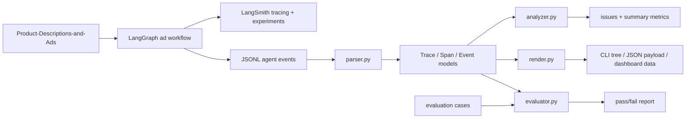

# Architecture

This project is a small Agent observability and evaluation harness. The mature architecture uses LangGraph for Agent workflow execution and LangSmith for tracing, datasets and experiments. A local JSONL trace path remains available as a reproducible fallback for CI and for inspecting the underlying trace mechanics.

## Goals

- Normalize multi-step Agent execution logs into `Trace -> Span -> Event`.
- Preserve Agent-specific signals: tool calls, tool results, token usage, latency, status, errors and intermediate events.
- Produce both machine-readable JSON and human-readable tree output.
- Provide a static dashboard payload for inspecting trace structure without a hosted backend.
- Evaluate traces against case specs with deterministic checks.
- Run a LangGraph workflow over a public advertising dataset.
- Trace/evaluate the workflow through LangSmith when credentials are available.
- Emit parseable local JSONL traces for deterministic CI and offline inspection.

## Non-goals

- This is not a replacement for LangSmith, Arize Phoenix, Langfuse or OpenTelemetry collectors.
- It does not claim production traffic, internal company data or private system integration.
- It intentionally uses JSONL and static frontend assets so the full demo remains reproducible from a cloned repository.

## Data Flow

## Trace Model

- `Trace`: one user/task execution, with context, metadata, tags and spans.
- `Span`: one execution step, such as an agent loop, LLM call, retrieval step or tool invocation.
- `SpanEvent`: intermediate observations, thoughts, messages or errors.
- `ToolCall`: structured tool name, arguments, result, status and error.
- `TokenUsage`: prompt, completion, reasoning, cached and total token counts.

The vocabulary deliberately mirrors common observability systems while keeping the implementation small enough to inspect. The schema can be mapped toward OpenTelemetry GenAI span conventions, especially inference, retrieval and tool execution spans.

## Evaluation Case Spec

Evaluation cases are small JSON records that bind a public or synthetic task to an observed `trace_id`.

Supported deterministic checks:

- maximum error count
- maximum total token budget
- maximum duration
- required tool usage

This is intentionally not an LLM-as-judge system. The goal is to provide a stable baseline that can run in CI without model access.

## LangGraph Harness

`src/agent_trace_tool/langgraph_ad_agent.py` builds a LangGraph `StateGraph` with five nodes:

1. `parse_brief`
2. `plan_strategy`
3. `generate_ad`
4. `compliance_check`
5. `score_ad`

Each node is instrumented into JSONL trace events. Agent/LLM-style steps are written as `span_start` / `span_end`; tool-like steps are written as `tool_call` / `tool_result`.

The workflow uses `data/product_ads_sample.json`, a small snapshot of the public Hugging Face dataset `llm-wizard/Product-Descriptions-and-Ads`.

## LangSmith Experiment Path

`src/agent_trace_tool/langsmith_experiment.py` provides the production-style path:

- converts the public dataset snapshot into LangSmith examples
- wraps the LangGraph harness with `@traceable`
- runs `langsmith.evaluate`
- attaches row-level evaluators for compliance and ad structure

This path requires `LANGSMITH_API_KEY` and is intentionally not required in CI. The local JSONL path continues to validate the same core workflow without external credentials.

## Why This Is Useful

Agent failures are often hidden inside a chain of planning, retrieval, tool calls and final response generation. A compact trace harness makes these failure modes visible:

- failed tool calls
- orphan spans
- missing span end events
- high latency spans
- high token usage spans

The project demonstrates the bottom layer of Agent debugging: reliable execution records before subjective output scoring.
